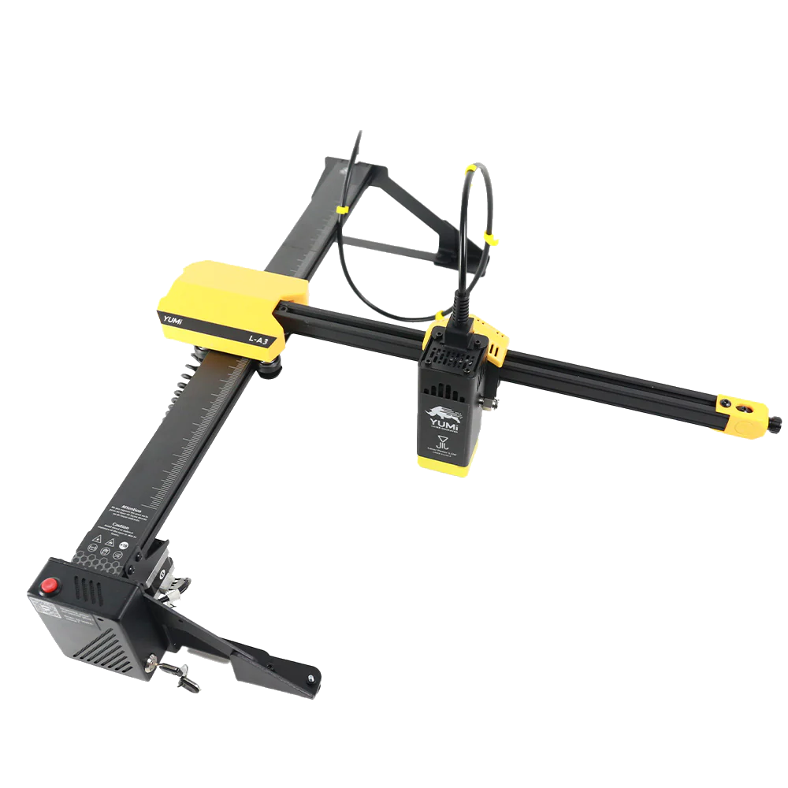

# 🔥 YUMI LASER 🔥  
Un projet pour découvrir et maîtriser l'utilisation du graveur laser **Yumi L-A2/3/4**.

---

## 📌 À propos  

    
Bienvenue sur le projet **Yumi Laser** !   
Ce dépôt regroupe toutes les **informations essentielles** sur l'utilisation du **graveur laser Yumi**, en mettant l'accent sur :  

✅ La **sécurité** lors de l'utilisation du laser (classe 4, risques oculaires et incendie).  
✅ Le **matériel** utilisé (DLC32, composants, câblage, alimentation).  
✅ Le **logiciel** principal (**LightBurn**) et son paramétrage.  
✅ Des **guides détaillés** pour débuter avec le laser et réaliser des projets.  

---

## 🚀 Fonctionnalités  
🔹 **Installation et configuration** du laser et du firmware.  
🔹 **Paramétrage et connexion** avec **LightBurn** et **LaserGRBL**.  
🔹 **Guides de sécurité** et bonnes pratiques.  
🔹 **Exemples de gravures et de découpes** avec des fichiers prêts à l'emploi.  

---

## ⚙️ Matériel utilisé  
Le graveur laser **Yumi L-A2/3/4** repose sur l’électronique **DLC32**, qui offre :  
✔ Une **connexion WiFi** et un contrôle via un navigateur web.  
✔ Une **interface avec écran tactile** (selon modèle).  
✔ Une **compatibilité avec LightBurn et LaserGRBL**.  

💡 **Documentation matérielle disponible :**  
- [📖 Manuel de câblage DLC32](docs/DLC32-wiring-manual.pdf)  
- [📖 Instructions de programmation firmware](docs/DLC32-Firmware.pdf)  

---

## 💻 Logiciel utilisé  
### 🔹 **LightBurn**  
Le logiciel principal pour gérer la gravure et la découpe laser.  
- [📥 Télécharger LightBurn](https://lightburnsoftware.com/pages/download-trial)  
- [📖 Manuel LightBurn](docs/LightBurn-Guide.pdf)  

### 🔹 **LaserGRBL** *(alternative gratuite)*  
- [📥 Télécharger LaserGRBL](https://lasergrbl.com/)  

---

## 🛠️ Installation & Configuration  
1️⃣ **Installation du logiciel** :  
   - Téléchargez et installez **[LightBurn](https://lightburnsoftware.com/pages/download-trial)** ou **LaserGRBL**.  
   - Connectez votre laser via USB ou WiFi.  

2️⃣ **Configuration du laser** :  
   - Paramétrez la machine dans LightBurn (`Find My Laser`).  
   - Vérifiez la mise à jour du firmware DLC32 ([Guide ici](docs/DLC32-Firmware.pdf)).  

3️⃣ **Sécurité avant tout** ⚠️  
   - **Utilisation obligatoire** de **lunettes de protection adaptées**.  
   - **Ventilation et évacuation des fumées** lors de la gravure.  
   - **Ne jamais laisser le laser sans surveillance**.  

---

## 📚 Documentation  
📖 **[Guide d'installation](docs/Installation-Guide.pdf)**  
📖 **[Manuel d'utilisation de LightBurn](docs/LightBurn-Guide.pdf)**  
📖 **[Sécurité & Bonnes pratiques](docs/Safety-Guidelines.pdf)**  

---

## 📩 Support & Contribution  
💬 **Une question ?** Ouvre une **[Issue](https://github.com/qnexo/yumi-laser/issues)**.  
🚀 **Envie d'améliorer ce projet ?** Fais une **Pull Request** !  
📧 **Contact :** yumi-laser-support@email.com  

---

💡 *"Gravez vos idées avec précision et créativité !"*  
  

