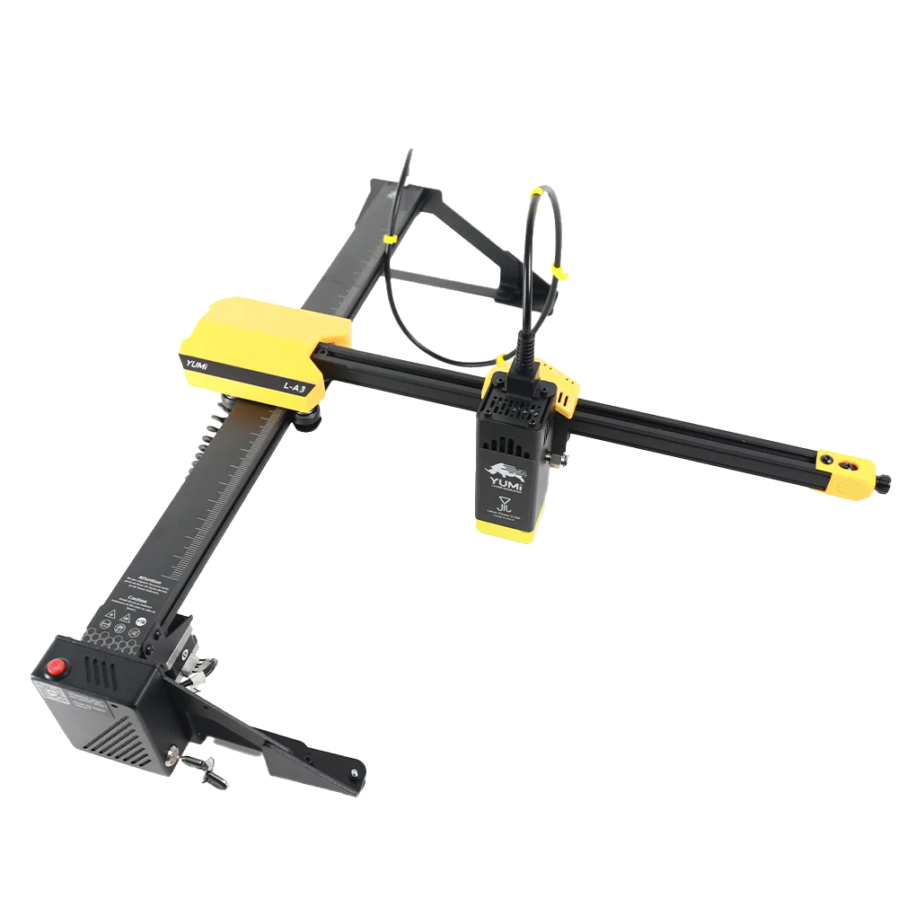

# Yumi Laser - Documentation Complète

&nbsp;
&nbsp;
&nbsp;
&nbsp;
&nbsp;

&nbsp;
&nbsp;
&nbsp;

Bienvenue dans **le dépôt de référence pour modifier, améliorer et dompter le YUMI L-A**.  
Tu veux flasher un firmware propre, ajouter des capteurs de fin de course, activer le Wi-Fi sans écran, ou même modéliser des pièces pour ta machine ? 

T’es au bon endroit.

---

## 🚀 Objectif du projet

Ce dépôt regroupe **tout le nécessaire pour transformer ton YUMI L-A2** en une machine stable, modulaire et digne de projets sérieux.  
On parle ici de modifications concrètes testées IRL, pas de théories de forum.

---

## 📚 Sommaire
- [🛠️ Installation et Montage](#️[installation-et-montage]https://github.com/qnexo/yumi-laser/blob/main/docs/yumi-laser-l-a4-a3-montage.pdf)
- [🚀 Firmware](#firmware)
- [📶 Configuration WiFi](#configuration-wifi)
- [📐 Logiciel LightBurn](#logiciel-lightburn)
- [⚠️ Consignes de sécurité](#consignes-de-sécurité)
- [🛎️ Assistance et support](#assistance-et-support)
- [📜 Licence](#licence)

---

## 🧰 Contenu du dépôt

📁 firmware/ → Firmware GRBL modifié (capteurs, Wi-Fi, configs YUMI)

📁 hardware/ → STL/STEP, plans de montage, upgrades mécaniques

📁 docs/ → Fiches techniques et manuels PDF

📁 modifications/ → Étapes pas-à-pas pour les hacks (photos, branchements, etc.)

📁 tools/ → Scripts et utilitaires de flash/test

---

## 🛠️ Modifications principales

- ✅ Activation des **capteurs de fin de course**
- ✅ Activation du **Wi-Fi sans écran**
- ✅ Modification de la configuration GRBL pour laser YUMI
- ✅ Intégration de pièces imprimables (ventilateurs, support module, etc.)
- 🚧 [À venir] Ajout d’un relais de sécurité / arrêt d’urgence

---

## ⚙️ Installer le firmware

> 🔥 **Important** : Sauvegarde ton firmware d’origine si tu veux pouvoir revenir en arrière.

1. Branche ton YUMI via USB
2. Ouvre `tools/flasher.bat` *(ou utilise `avrdude` si tu préfères la ligne de commande)*
3. Flash le fichier `.hex` adapté à ta config depuis `firmware/`
4. Redémarre, connecte avec un terminal série (115200 baud)
5. Tape `$$` pour vérifier les réglages

---

## 🔌 Branchement des capteurs (Endstops)

**Type** : capteur mécanique Normally Open (NO)  
**Connexion** :
- X min → pin D9
- Y min → pin D10  
(Peut varier selon le modèle de carte – voir `docs/yumi-board-pinout.pdf`)

📸 *Voir photos dans `modifications/endstop-photos/`*

---

## 📷 Aperçus

  
*Vue avant avec support capteurs et module laser 10W*

---

## 📬 Contact & communauté

👉 Groupe WhatsApp : [**lien à insérer**]  
📧 Contact : qnexo.dev@gmail.com *(ou autre mail/profil si tu préfères)*

---

## ❤️ Contribuer

Les PR sont bienvenues. Merci de :
- Forker ce dépôt
- Travailler sur une branche dédiée
- Proposer une modif claire avec explication

---

## 🧠 À faire (Roadmap)

- [ ] Ajout d’un support écran TFT
- [ ] Ajout d’un système d’extraction d’air imprimable
- [ ] Création d’un profil LightBurn optimisé
- [ ] Documentation FR/EN parallèle

---

**Hack the machine. Dompte la lumière. 🔥**
